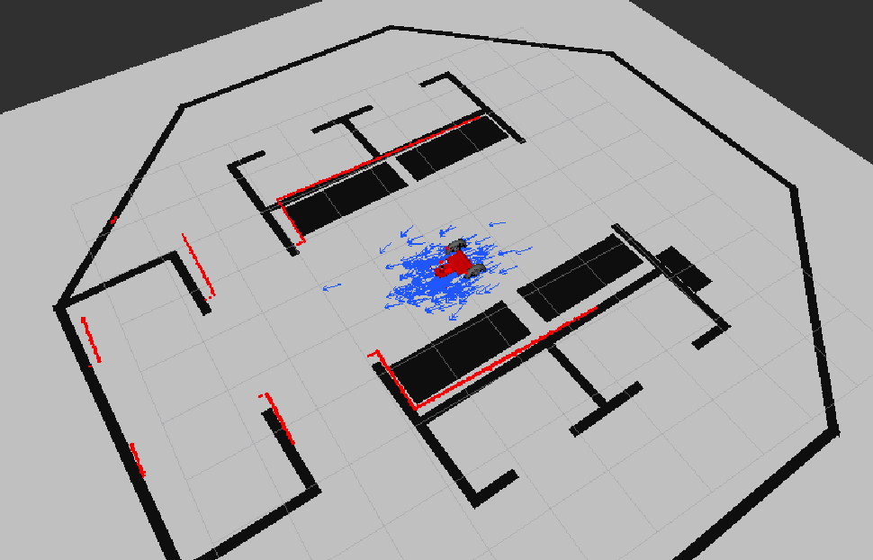
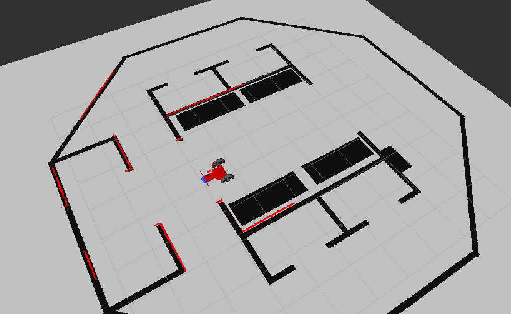
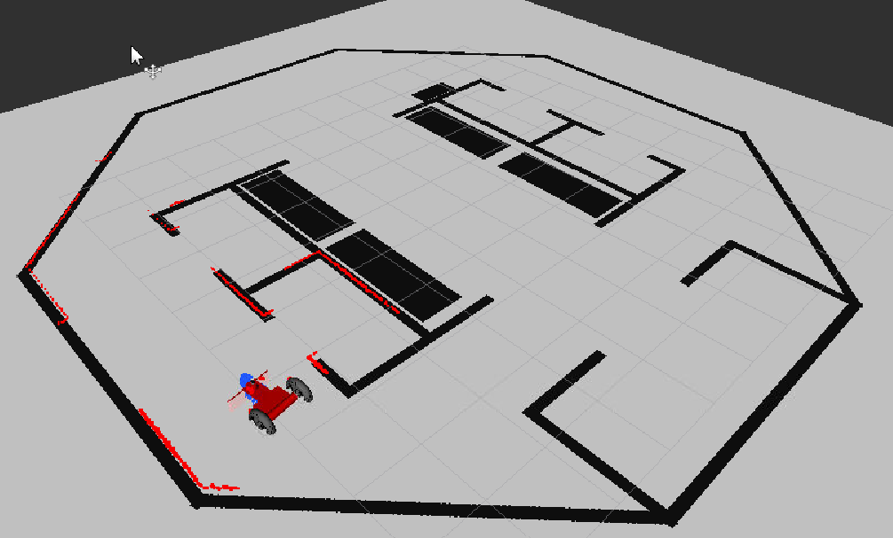
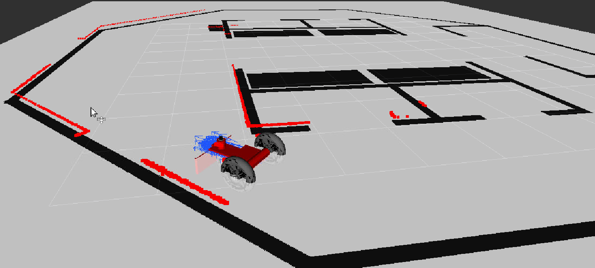
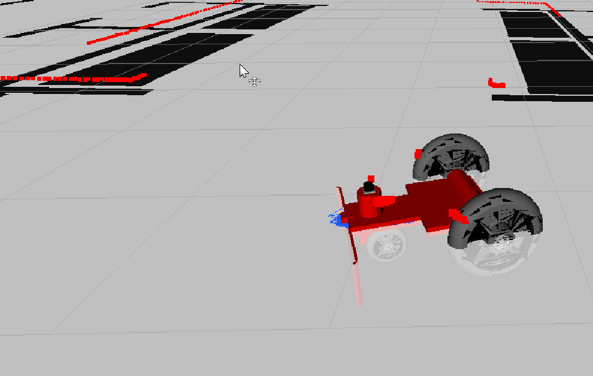

# RoboProj3
Udacity Robotics Software Engineer Nanodegree Project #3.

Adaptive Monte Carlo Localization (AMCL), also known as particle filter localization, is used to localize a robot within a simulated Gazebo world using the ROS amcl package.

## Dependencies

ROS: Install Robot Operating System (ROS) by following these instructions: http://wiki.ros.org/Installation
   * Follow the instructions for a Destop-Full Install, which will include rviz and other packages required by this repository.


Gazebo: Follow the instructions for your environment at http://gazebosim.org/tutorials?cat=install

Ubuntu one line installation:
```bash
$ curl -sSL http://get.gazebosim.org | sh
```

## Installation

Step 1:
Clone the repository into your workspace
```bash
$ git clone https://www.github.com/joestilin/RoboProj3
```

Step 2:
Initialize a catkin workspace inside src
```bash
$ cd /RoboProj3/catkin_ws/src
$ catkin_init_workspace
```
Step 3:
Move up to the catkin workspace root, build the package, and source the environment
```bash
$ cd ..
$ catkin_make
$ source devel/setup.bash
```

## Usage

1. Launch ```world.launch```
```bash
$ cd /RoboProj3/catkin_ws
$ roslaunch my_robot world.launch
```

2. Open a new terminal and launch ```amcl.launch```
```bash
$ cd /RoboProj3/catkin_ws
$ source devel/setup.bash
$ roslaunch my_robot amcl.launch
```

3. In rviz, set configuration to ```/RoboProj3/amcl.rviz``` to set world frame and
display the map, robot, laser scan, and particle cloud generated by amcl.

# Moving Around With Keyboard
Open a new terminal and run ```teleop_keyboard_twist.py```
```bash
$ cd /RoboProj3/catkin_ws
$ source devel/setup.bash
$ rosrun teleop_twist_keyboard teleop_twist_keyboard.py
```

# Move with a ```2D Nav Goal```
In rviz, select ```2D Nav Goal```, click and drag a navigation goal.

## What does this look like?
#### Initial pose and point cloud:


#### Localized robot after moving forward:


#### Localized robot navigating the world:


#### Point cloud expands slightly while turning:


#### Localization is precise after moving forward for a while:

